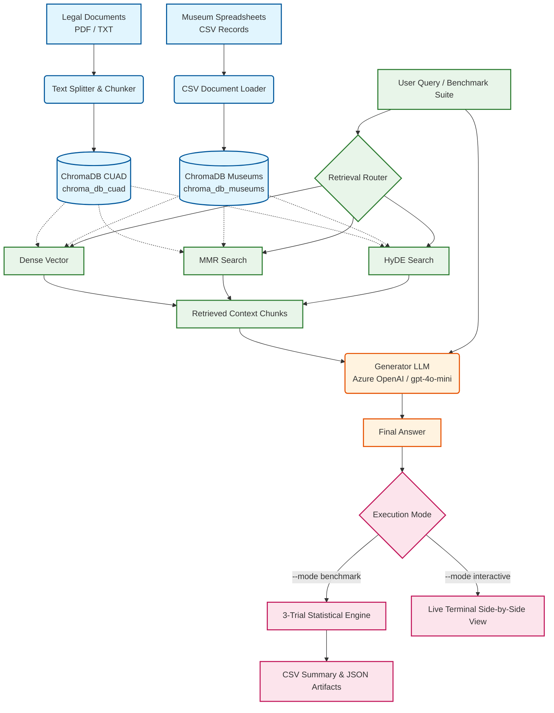

# Domain-Specific RAG System with Rigorous Evaluation


## Project Overview
As Retrieval-Augmented Generation (RAG) becomes the standard for domain-specific AI, assessing these systems via "vibes" or manual review is no longer sufficient. This repository provides a **fully automated, rigorous evaluation framework** that transitions RAG development from a "ship-and-pray" loop to a "measure-and-improve" loop.

This project implements a multi-strategy RAG pipeline—comparing **Dense Vector**, **Maximal Marginal Relevance (MMR)**, and **Hypothetical Document Embeddings (HyDE)**—and evaluates them across multi-trial statistical benchmarks or live interactive sessions. It supports both unstructured domain documents (e.g., CUAD Legal Texts) and structured datasets (e.g., Museum Archives in CSV format).

The framework isolates retrieval failures from generation failures, utilizing an LLM-as-a-judge paradigm alongside system heuristics (Latency, Token Efficiency, and Cost Tracking) and deterministic n-gram overlap metrics (ROUGE-L).

**Designed for academic and production research, this repository serves to demonstrate advanced competency in modern LLM orchestration, vector search optimization, and reproducible AI evaluation.**

---

## System Architecture

The pipeline supports dual dataset loaders, multi-vector persistence stores, three distinct retrieval strategies, and dual execution modes (Automated Benchmarking vs. Interactive CLI).



# Technical Documentation & Evaluation Guide

## The 7 Evaluation Metrics

Evaluating a RAG system requires decoupling **retriever performance** from **generator performance**. A system that generates an incorrect answer may fail because it retrieved bad context (retriever failure) or because it hallucinated despite good context (generator failure).

This framework tracks 7 complementary metrics across the entire pipeline:

### 1. Generator Metrics (LLM-as-a-Judge)

#### Faithfulness (0.0 to 1.0)
* **What it measures:** The factual consistency of the generated answer relative to the retrieved context.
* **Mechanism:** The evaluator breaks the generated answer down into individual claims and checks whether each claim can be logically deduced from the retrieved context chunks.
* **Why it matters:** Detects hallucinations and ensures the LLM stays strictly bounded within domain documentation.
* **Target:** `> 0.90`

#### Answer Relevancy (0.0 to 1.0)
* **What it measures:** How directly and completely the generated answer responds to the initial question.
* **Mechanism:** The evaluator generates artificial questions based on the generated answer and measures the cosine similarity between those generated questions and the original input question.
* **Why it matters:** Penalizes responses that are verbose, evasive, or go off on tangents, even if factually accurate.
* **Target:** `> 0.85`

---

### 2. Retriever Metrics (LLM-as-a-Judge)

#### Context Precision (0.0 to 1.0)
* **What it measures:** The signal-to-noise ratio within the top-$K$ retrieved chunks.
* **Mechanism:** Evaluates whether all retrieved context chunks are relevant to answering the query, with higher weight assigned to relevant chunks appearing near the top of the context window.
* **Why it matters:** Low context precision increases prompt token costs and can confuse the LLM with irrelevant details.
* **Target:** `> 0.80`

#### Context Recall (0.0 to 1.0)
* **What it measures:** The coverage of ground-truth information within the retrieved chunks.
* **Mechanism:** Compares every sentence in the ground-truth answer against the retrieved chunks to verify if the required knowledge was successfully retrieved from the vector store.
* **Why it matters:** If context recall is low, the generator cannot synthesize a complete answer without relying on internal (and potentially outdated) knowledge.
* **Target:** `> 0.90`

---

### 3. Structural & System Metrics

#### ROUGE-L (0.0 to 1.0)
* **What it measures:** Longest Common Subsequence (LCS) F1-score between the generated answer and the ground-truth reference answer.
* **Mechanism:** Counts the longest sequence of words that appear in both texts in the same relative order (without requiring contiguous matching).
* **Why it matters:** Provides a deterministic, non-LLM safety net to evaluate structural and syntactic alignment against reference answers.
* **Target:** `> 0.65`

#### Latency (Seconds)
* **What it measures:** End-to-end processing time from initial user query input to final answer generation and formatting.
* **Mechanism:** Calculated via exact timer offsets surrounding retrieval execution and LLM chain invocation.
* **Why it matters:** Evaluates the real-world performance cost of complex retrieval strategies (e.g., multi-query vs. HyDE).
* **Target:** `< 3.0s` for interactive applications.

#### Token Efficiency & Cost Tracking
* **What it measures:** Conciseness and context compression ratio, computed as:
  $$\text{Token Efficiency} = \frac{\text{Answer Tokens}}{\text{Context Tokens}}$$
* **Mechanism:** Tracks exact token usage per API call and computes estimated cost based on active model pricing (e.g., Azure OpenAI rates).
* **Target:** `0.05 to 0.15` (depending on query complexity).

---

## Comparative Analysis of Retrieval Strategies

The system evaluates three distinct retrieval strategies on every query:

| Strategy | Algorithmic Mechanism | Primary Use Case | Key Advantages | System Trade-offs |
| :--- | :--- | :--- | :--- | :--- |
| **Dense Vector** | Standard Cosine Similarity over dense text embeddings. | Baseline domain search. | • Lowest latency<br/>• Simple vector lookup | • Susceptible to returning redundant chunks<br/>• Struggles when query/document vocabulary differs |
| **MMR** | Maximal Marginal Relevance balancing relevancy with diversity: $\text{ArgMax} [\lambda \text{Sim}_1(d, q) - (1-\lambda) \max \text{Sim}_2(d, d_i)]$. | Broad queries covering multiple sub-topics or artwork materials. | • Eliminates duplicate context<br/>• Maximizes info density per token | • Minimal latency overhead ($K \times 4$ candidate fetch) |
| **HyDE** | Generates a hypothetical LLM answer first, then uses the hypothetical passage to query the vector index. | Nuanced or zero-shot technical queries. | • Bridges vocabulary gaps<br/>• Significantly improves Context Recall | • Higher latency (requires two sequential LLM calls)<br/>• Potential cost increase |

---

## Dataset Ingestion & Schemas

### 1. Unstructured Documents (CUAD Legal Corpus)
Stored in `data/`, consisting of 408 SEC legal contracts parsed into text chunks using recursive character text splitters (`chunk_size=1000`, `chunk_overlap=200`).

### 2. Structured Spreadsheets (Italian Museum Dataset)
Stored as CSV files in `data_museums/`. Each row represents an artwork record parsed into a structured representation:
* **Schema Fields:** `museo`, `titolo`, `autore`, `datazione`, `tipologia`, `soggetto`, `materiale_tecnica`, `misure`, `luogo_conservazione`, `localizzazione`, `indirizzo`, `note_storico_critiche`.
* **Ingestion Mapping:** Each row is converted into a rich textual block with attached metadata (`museum`, `artwork_name`, `source_file`) for precise tracking.

---

## Environment Setup & Credentials

### 1. System Requirements
* Python 3.10+
* Azure OpenAI or OpenAI API Access

### 2. Environment Setup
Clone the repository and set up your virtual environment:

```bash
git clone [https://github.com/ToppatKing/7-metric-rag-eval-system.git](https://github.com/ToppatKing/7-metric-rag-eval-system.git)
cd 7-metric-rag-eval-system

python -m venv venv
source venv/bin/activate  # On Windows: venv\Scripts\activate

pip install -r requirements.txt
pip install pandas openpyxl
```

### 3. API Credentials (GitHub Codespaces / `.env`)
Configure the following secrets in your `.env` file or GitHub Codespace Secrets:

**Azure OpenAI Configuration:**
```env
AZURE_OPENAI_API_KEY=your_azure_key
AZURE_OPENAI_ENDPOINT=[https://your-resource-name.openai.azure.com/](https://your-resource-name.openai.azure.com/)
AZURE_OPENAI_API_VERSION=2024-02-15-preview
AZURE_OPENAI_CHAT_DEPLOYMENT=gpt-4o-mini
AZURE_OPENAI_EMBEDDING_DEPLOYMENT=text-embedding-3-small
```

**Standard OpenAI Configuration (Alternative):**
```env
OPENAI_API_KEY=sk-proj-your-actual-api-key-here
```

## Quickstart & Execution Modes

The execution engine is controlled via CLI flags in `main.py`.

### CLI Options Reference

| Argument | Choices | Default | Description |
| :--- | :--- | :--- | :--- |
| `--dataset` | `cuad`, `museums` | `cuad` | Selects data directory and vector database store. |
| `--mode` | `benchmark`, `interactive` | `benchmark` | Selects automated 3-trial benchmarking or interactive prompt mode. |
| `--force_reindex` | Flag | `False` | Forces a complete purge and rebuild of the vector database. |
| `--corpus_dir` | Path | Auto | Overrides default dataset path (`data` or `data_museums`). |
| `--persist_dir` | Path | Auto | Overrides vector database store directory (`chroma_db_cuad` or `chroma_db_museums`). |

---

### Command Examples

#### Option A: Run the Automated CUAD Legal Benchmark
Executes 3 statistical trials across Dense, MMR, and HyDE strategies, outputting summary CSVs and JSON manifests into `results/`.

```bash
# First-time build of CUAD vector database:
python main.py --dataset cuad --mode benchmark --force_reindex

# Subsequent benchmark runs using cached database:
python main.py --dataset cuad --mode benchmark
```

#### Run Interactive Queries on Museum Records
Launches a live terminal session allowing you to input custom queries, optional ground truth answers, and observe side-by-side strategy responses.

```bash
# First-time build of Museum CSV vector database:
python main.py --dataset museums --mode interactive --force_reindex

# Subsequent interactive sessions:
python main.py --dataset museums --mode interactive
```

## License & Citation

### License
This project is released under the MIT License.

### Citation
If you use this evaluation framework or codebase for research, academic work, or thesis development, please cite it as:

```bibtex
@bachelorsthesis{rag_evaluation_framework_2026,
  title        = {Domain-Specific Retrieval-Augmented Generation with Multi-Metric Strategy Evaluation},
  author       = {Jacopo Bandinelli},
  year         = {2026},
  school       = {Universita' degli Studi di Firenze},
  note         = {GitHub Repository: [https://github.com/ToppatKing/7-metric-rag-eval-system](https://github.com/ToppatKing/7-metric-rag-eval-system)}
}