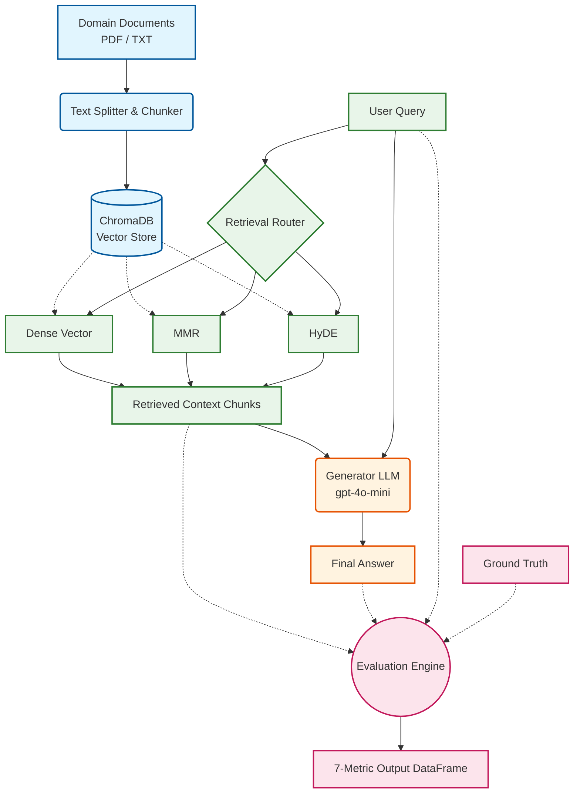

# Domain-Specific RAG System with Rigorous Evaluation


## Project Overview
As Retrieval-Augmented Generation (RAG) becomes the standard for domain-specific AI, assessing these systems via "vibes" or manual review is no longer sufficient. This repository provides a **fully automated, rigorous evaluation framework** that transitions RAG development from a "ship-and-pray" loop to a "measure-and-improve" loop.

This project implements a multi-strategy RAG pipeline—comparing **Dense Vector**, **Maximal Marginal Relevance (MMR)**, and **Hypothetical Document Embeddings (HyDE)**—and evaluates them simultaneously against a robust 7-metric framework. It isolates retrieval failures from generation failures, utilizing an LLM-as-a-judge paradigm (via `ragas`) alongside deterministic n-gram overlap metrics (ROUGE-L) and system heuristics (Latency & Token Efficiency).

**Designed for academic and production research, this repository serves to demonstrate advanced competency in modern LLM orchestration, vector search optimization, and reproducible AI evaluation.**

---

## System Architecture

The pipeline is split into three main components: Document Ingestion, Multi-Strategy Retrieval, and the 7-Metric Evaluation Engine.



# Technical Documentation & Evaluation Guide

This document provides a deep dive into the theoretical framework, metric definitions, retrieval strategies, and execution steps for the Domain-Specific RAG Evaluation System.

---

## A Deep Dive: The 7 Evaluation Metrics

Evaluating a RAG system requires decoupling **retriever performance** from **generator performance**. A system that generates an incorrect answer may fail because it retrieved bad context (retriever failure) or because it hallucinated despite good context (generator failure).

This framework tracks 7 complementary metrics across the entire pipeline:

### 1. Generator Metrics (LLM-as-a-Judge)

#### Faithfulness (0.0 to 1.0)
* **What it measures:** The factual consistency of the generated answer relative to the retrieved context.
* **Mechanism:** The evaluator breaks the generated answer down into individual claims and checks whether each claim can be logically deduced from the retrieved context chunks.
* **Why it matters:** Detects hallucinations and ensures the LLM stays strictly bounded within domain documentation.
* **Target:** `> 0.90`

#### Answer Relevancy (0.0 to 1.0)
* **What it measures:** How directly and completely the generated answer responds to the initial question.
* **Mechanism:** The evaluator generates artificial questions based on the generated answer and measures the cosine similarity between those generated questions and the original input question.
* **Why it matters:** Penalizes responses that are verbose, evasive, or go off on tangents, even if factually accurate.
* **Target:** `> 0.85`

---

### 2. Retriever Metrics (LLM-as-a-Judge)

#### Context Precision (0.0 to 1.0)
* **What it measures:** The signal-to-noise ratio within the top-$K$ retrieved chunks.
* **Mechanism:** Evaluates whether all retrieved context chunks are relevant to answering the query, with higher weight assigned to relevant chunks appearing near the top of the context window.
* **Why it matters:** Low context precision increases prompt token costs and can confuse the LLM with irrelevant details.
* **Target:** `> 0.80`

#### Context Recall (0.0 to 1.0)
* **What it measures:** The coverage of ground-truth information within the retrieved chunks.
* **Mechanism:** Compares every sentence in the ground-truth answer against the retrieved chunks to verify if the required knowledge was successfully retrieved from the vector store.
* **Why it matters:** If context recall is low, the generator cannot synthesize a complete answer without relying on internal (and potentially outdated) knowledge.
* **Target:** `> 0.90`

---

### 3. Structural & System Metrics

#### ROUGE-L (0.0 to 1.0)
* **What it measures:** Longest Common Subsequence (LCS) F1-score between the generated answer and the ground-truth reference answer.
* **Mechanism:** Counts the longest sequence of words that appear in both texts in the same relative order (without requiring contiguous matching).
* **Why it matters:** Provides a deterministic, non-LLM safety net to evaluate structural and syntactic alignment against reference answers.
* **Target:** `> 0.65`

#### Latency (Seconds)
* **What it measures:** End-to-end processing time from initial user query input to final answer generation and formatting.
* **Mechanism:** Calculated via exact timer offsets surrounding retrieval execution and LLM chain invocation.
* **Why it matters:** Evaluates the real-world performance cost of complex retrieval strategies (e.g., multi-query vs. HyDE).
* **Target:** `< 3.0s` for interactive applications.

#### Token Efficiency (Ratio)
* **What it measures:** Conciseness and context compression ratio, computed as:
  $$\text{Token Efficiency} = \frac{\text{Answer Tokens}}{\text{Context Tokens}}$$
* **Mechanism:** Uses model-specific tokenizers (`tiktoken`) to compute the exact ratio of generated output tokens to ingested context tokens.
* **Why it matters:** Identifies bloated context windows that return massive blocks of text for short, simple answers.
* **Target:** `0.05 to 0.15` (depending on query complexity).

---

##  Comparative Analysis of Retrieval Strategies

The system simulates three distinct retrieval strategies on every query:

| Strategy | Algorithmic Mechanism | Primary Use Case | Key Advantages | System Trade-offs |
| :--- | :--- | :--- | :--- | :--- |
| **Dense Vector** | Standard Cosine Similarity over dense text embeddings ($e(q) \cdot e(d)$). | Baseline domain search. | • Lowest latency<br/>• Simple vector lookup | • Susceptible to returning redundant chunks<br/>• Struggles when query/document vocabulary differs |
| **MMR** | Maximal Marginal Relevance balancing relevancy with diversity: $\text{ArgMax} [\lambda \text{Sim}_1(d, q) - (1-\lambda) \max \text{Sim}_2(d, d_i)]$. | Broad queries covering multiple sub-topics. | • Eliminates duplicate context<br/>• Maximizes info density per token | • Minimal latency overhead ($K \times 4$ candidate fetch) |
| **HyDE** | Generates a hypothetical LLM answer first, then uses the hypothetical passage to query the vector index. | Nuanced or zero-shot technical queries. | • Bridges vocabulary gaps<br/>• Significantly improves Context Recall | • Higher latency (requires two sequential LLM calls) |

---

##  Quickstart & Usage

### 1. System Requirements
* Python 3.10+
* OpenAI API Key (configured with `gpt-4o-mini` and `text-embedding-3-small`)

### 2. Environment Setup
Clone the repository and set up your virtual environment:

```bash
git clone [https://github.com/ToppatKing/thesis_rag_eval.git](https://github.com/ToppatKing/thesis_rag_eval.git)
cd thesis_rag_eval

python -m venv venv
source venv/bin/activate  # On Windows: venv\Scripts\activate

pip install -r requirements.txt
```

Create a `.env` file in the root directory:

```env
OPENAI_API_KEY=sk-proj-your-actual-api-key-here

### 3. Interactive Execution
Run the interactive pipeline:
```

```bash
python main.py

Follow the CLI prompts:

1. **Document Folder Path:** Enter the local folder containing your domain `.pdf` or `.txt` files (e.g., `./data` or `/Users/name/Documents/Papers`).
2. **User Question:** Enter your specific domain question.
3. **Ground Truth Answer:** Enter the gold-standard reference answer used to compute Context Recall and ROUGE-L.
```

## Interpreting Execution Results

Upon completing the simulations, the pipeline prints a detailed comparison table and exports the raw data to `rag_evaluation_results.csv`.

### Example CLI Output table

```text
============================================================
 EVALUATION RESULTS COMPARISON 
============================================================
| Metric            |   DENSE |     MMR |    HYDE |
|:------------------|--------:|--------:|--------:|
| Faithfulness      |  1.0000 |  1.0000 |  1.0000 |
| Answer Relevancy  |  0.8921 |  0.9341 |  0.9812 |
| Context Precision |  0.7500 |  0.8333 |  1.0000 |
| Context Recall    |  0.6667 |  0.8889 |  1.0000 |
| ROUGE-L           |  0.6215 |  0.7042 |  0.8210 |
| Latency (s)       |  1.2104 |  1.3852 |  2.7410 |
| Token Efficiency  |  0.0652 |  0.0712 |  0.0894 |
============================================================
```

### Analytical Insights from Example Output:

* **HyDE** achieved superior Context Precision (1.00) and Context Recall (1.00) because generating a hypothetical answer aligned the search query with the terminology used in the domain documents.
* **MMR** delivered a strong middle ground, improving Context Recall from 0.6667 (Dense) to 0.8889 with only a minor latency cost (+0.17s).
* **Dense Vector** had the lowest latency (1.21s), making it ideal for real-time systems where context coverage requirements are less strict.

## License & Citation

### License
This project is released under the MIT License.

### Citation
If you use this evaluation framework or codebase for research, academic work, or thesis development, please cite it as:

```bibtex
@mastersthesis{rag_evaluation_framework_2026,
  title        = {Domain-Specific Retrieval-Augmented Generation with Multi-Metric Strategy Evaluation},
  author       = {Jacopo Bandinelli},
  year         = {2026},
  school       = {Universita' degli Studi di Firenze},
  note         = {GitHub Repository: [https://github.com/ToppatKing/thesis_rag_eval](https://github.com/ToppatKing/thesis_rag_eval)}
}
